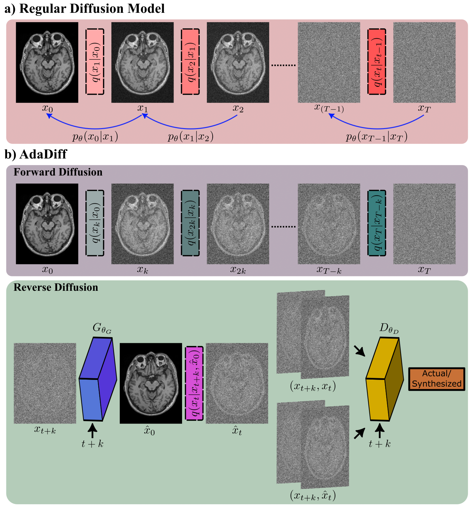
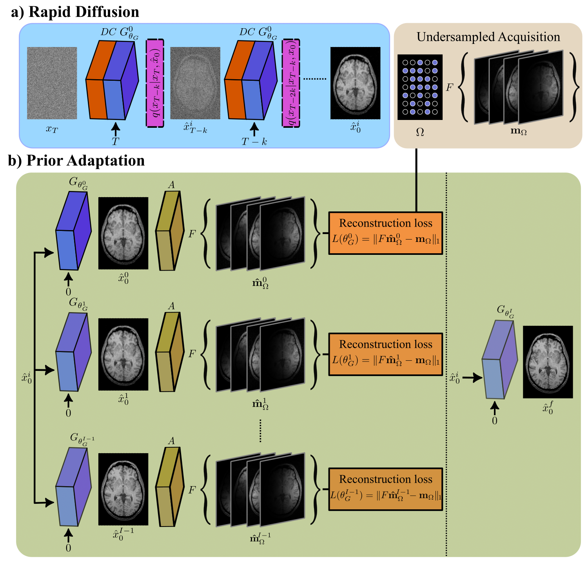

# AdaDiff

Official PyTorch implementation of AdaDiff described in the [paper](https://arxiv.org/abs/2207.05876).

Salman UH Dar, Şaban Öztürk, Yilmaz Korkmaz, Gokberk Elmas, Muzaffer Özbey, Alper Güngör, Tolga Çukur, "Adaptive Diffusion Priors for Accelerated MRI Reconstruction", arXiv 2022.





## Dependencies

```
python>=3.6.9
torch>=1.7.1
torchvision>=0.8.2
cuda=>11.2
ninja
python3.x-dev (apt install, x should match your python3 version, ex: 3.8)
```

## Installation
- Clone this repo:
```bash
git clone https://github.com/icon-lab/AdaDiff
cd AdaDiff
```

## Train

<br />

For Single-Coil
```
python3 train_adadiff_singlecoil.py --dataset brain --image_size 256 --exp experiment_name_for_singlecoil --num_channels 1 --num_channels_dae 64 --ch_mult 1 1 2 2 4 4 --num_timesteps 8 --num_res_blocks 2 --batch_size 8 --num_epoch 500 --ngf 64 --embedding_type positional --use_ema --ema_decay 0.999 --r1_gamma 1. --z_emb_dim 256 --lr_d 1e-4 --lr_g 1.6e-4 --lazy_reg 10 --num_process_per_node 1 --save_content --local_rank 0
```
For Multi-Coil
```
python3 train_adadiff_multicoil.py --dataset brain_multi_coil --image_size 288 --exp experiment_name_for_multicoil --num_channels 2 --num_channels_dae 64 --ch_mult 1 1 1 2 2 --num_timesteps 8 --num_res_blocks 2 --batch_size 4 --num_epoch 500 --ngf 64 --embedding_type positional --use_ema --ema_decay 0.999 --r1_gamma 1. --z_emb_dim 256 --lr_d 1e-4 --lr_g 1.6e-4 --lazy_reg 10 --num_process_per_node 1 --save_content --attn_resolutions 18 --local_rank 0
```
<br />

## Inference

<br />

For Single-Coil
```
python3 inference_adadiff_singlecoil.py --dataset brain --image_size 256 --exp content_folder_for_singlecoil --num_channels 1 --num_channels_dae 64 --ch_mult 1 1 2 2 4 4 --num_timesteps 8 --num_res_blocks 2 --epoch_id 1000 --batch_size 1 --lr_g 1e-3 --itr_inf 1000 --local_rank 0 --contrast T1 --phase test --save_inter True --R 4 --extra_string lr_1e3_opt_reset_ --reset_opt True
```
For Multi-Coil
```
python3 inference_adadiff_multicoil.py --dataset brain_multi_coil --image_size 288 --exp content_folder_for_multicoil --num_channels 2 --num_channels_dae 64 --ch_mult 1 1 1 2 2 --num_timesteps 8 --num_res_blocks 2  --epoch_id 1000 --batch_size 1 --lr_g 1e-3 --itr_inf 1000 --attn_resolutions 18 --local_rank 0 --phase test --contrast T1 --R 4 --save_inter True --extra_string lr_1e3_opt_reset --reset_opt True 
```

<br />
<br />


# Citation
You are encouraged to modify/distribute this code. However, please acknowledge this code and cite the paper appropriately.
```
@article{dar2022adaptive,
  title={Adaptive Diffusion Priors for Accelerated MRI Reconstruction},
  author={Dar, Salman UH and {\"O}zt{\"u}rk, {\c{S}}aban and Korkmaz, Yilmaz and Elmas, Gokberk and {\"O}zbey, Muzaffer and G{\"u}ng{\"o}r, Alper and {\c{C}}ukur, Tolga},
  journal={arXiv preprint arXiv:2207.05876},
  year={2022}
}

```

(c) ICON Lab 2022

<br />

# Acknowledgements

This code uses libraries from, [pGAN](https://github.com/icon-lab/pGAN-cGAN), [StyleGAN-2](https://github.com/NVlabs/stylegan2), and [DD-GAN](https://github.com/NVlabs/denoising-diffusion-gan) repositories.
